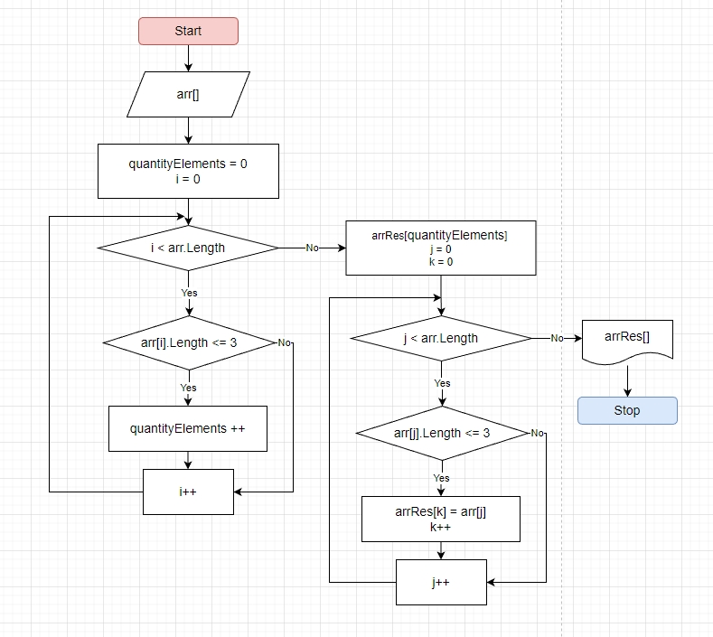

# Итоговая проверочная работа.
## Задача: 
Напишите программу, которая из имеющигося массива строк формирует массив из строк, длина которых меньше либо равна 3 символа. Первоночальный массив можно ввести с клавиатуры, либо задать на старте выполнения алгоритма.
## Необходимо выполнить:
1. Создать репозиторий на GitHub
2. Нарисовать блок-схему алгоритма (можно обойтись блок-схемой основной содержательной части, если вы выделяете её в отдельный метод)
3. Снабдить репозиторий оформленным текстовым описанием решения (файл README.md)
4. Написать программу, решающую поставленную задачу
5. Использавать контроль версий в работе над этим небольшим проектом (не должно быть так что все залито одним коммитом, как минимум этапы 2, 3 и 4 должны быть расположены в разных коммитах)

---
## Решение
Блок-схема выполнина на портале [app.diagrams.net](app.diagrams.net) и добавлена в проект в виде скриншота. 

Програмная часть выполнина на языке C# 

 1. Так как в C# нелзя менять размер массива, то проходим первый раз по начальному массиву чтобы определить количество элементов в итоговом массиве. 
 2. Создаем итоговый массив нужного размера. 
 3. Проходим по начальному массиву заполняя итоговый.
 4. Выводим итоговый массив в консоль.
